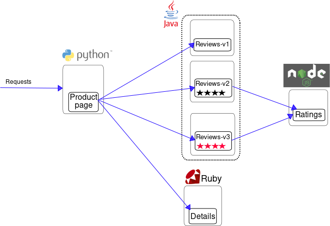
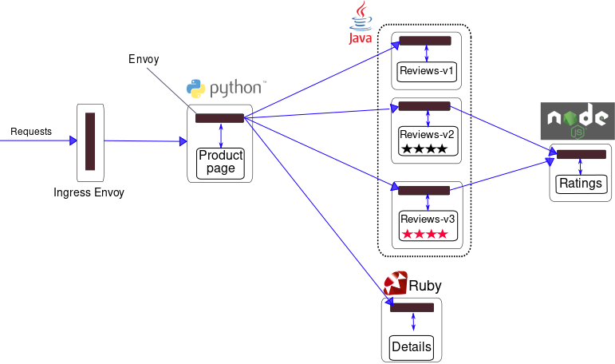

The BookInfo sample application deployed is composed of four microservices:

* The _productpage_ microservice calls the details and reviews microservices to populate the page.
* The _details_ microservice contains book information.
* The _reviews_ microservice contains book reviews. It also calls the ratings microservice.
* The _ratings_ microservice contains book ranking information that accompanies a book review.

There are 3 versions of the _reviews_ microservice:

* Version _v1_ doesn’t call the ratings service.
* Version _v2_ calls the ratings service and displays each rating as 1 to 5 black stars.
* Version _v3_ calls the ratings service and displays each rating as 1 to 5 red stars.

The services communicate over HTTP using DNS for service discovery. An overview of the architecture is shown below.

 

To run the sample with Istio requires no changes to the application itself. Instead, you simply need to configure and run the services in an Istio-enabled environment, with Envoy sidecars injected along side each service. The resulting deployment will look like this:

All of the microservices will be packaged with an Envoy sidecar that intercepts incoming and outgoing calls for the services, providing the hooks needed to externally control, via the Istio control plane, routing, telemetry collection, and policy enforcement for the application as a whole.

 

The source code for the application is available on [Github](https://github.com/istio/istio/tree/master/samples/bookinfo)
