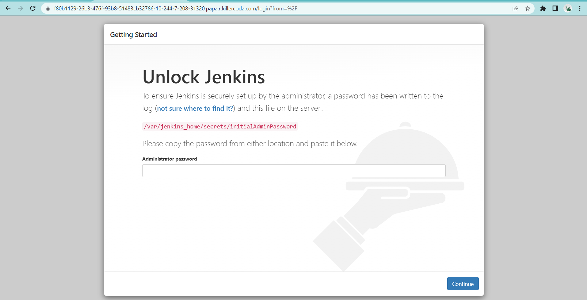

## Let's practice!

### Create namespace: `cloudnative`

### Create a `pod` with the following constraints:
1. Pod name: `jenkins`
2. Deploy pod in a `cloudnative` namespace
3. Add additional labels:
    a. app: jenkins
    b. company: stratpoint
4. Use this container image: `jenkins/jenkins:lts`
5. [Optional] Expose the pod using a service and check if `Jenkins` is running successfully
6. [Optional] Setup your `Jenkins` instance. YOu can check the ssh into the pod or check the logs for the admin password.
