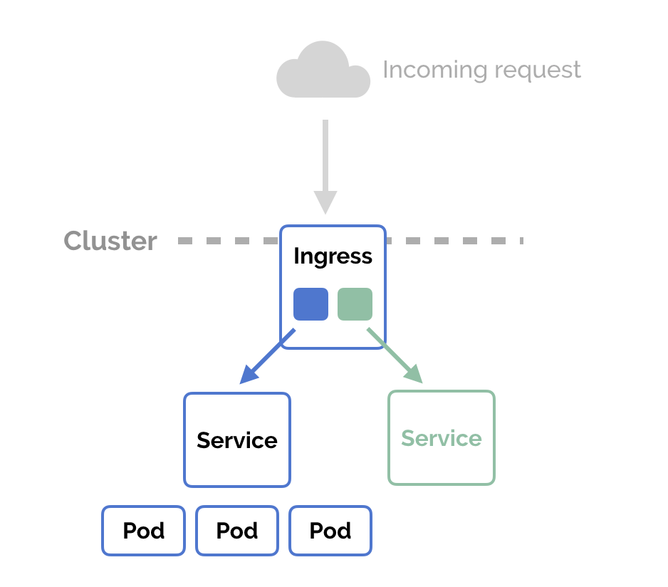

Traditionally, you would create a LoadBalancer service for each public system you want to expose. This can get rather expensive, very quickly. Ingress gives you a way to route requests to services based on the request host or path, centralizing a number of services into a single entrypoint (or in this case, load balancer).

### Ingress Resources

Ingress is split up into two main pieces. The first is an Ingress resource, which defines how you want requests routed to the backing services.

For example, a definition that defines an Ingress to handle requests for www.mysite.com and forums.mysite.com and routes them to the Kubernetes services named website and forums respectively would look like:

```
apiVersion: extensions/v1beta1
kind: Ingress
metadata:
  name: my-ingress
spec:
  rules:
  - host: www.mysite.com
    http:
      paths:
      - backend:
          serviceName: website
          servicePort: 80
  - host: forums.mysite.com
    http:
      paths:
      - path:
        backend:
          serviceName: forums
          servicePort: 80
```


